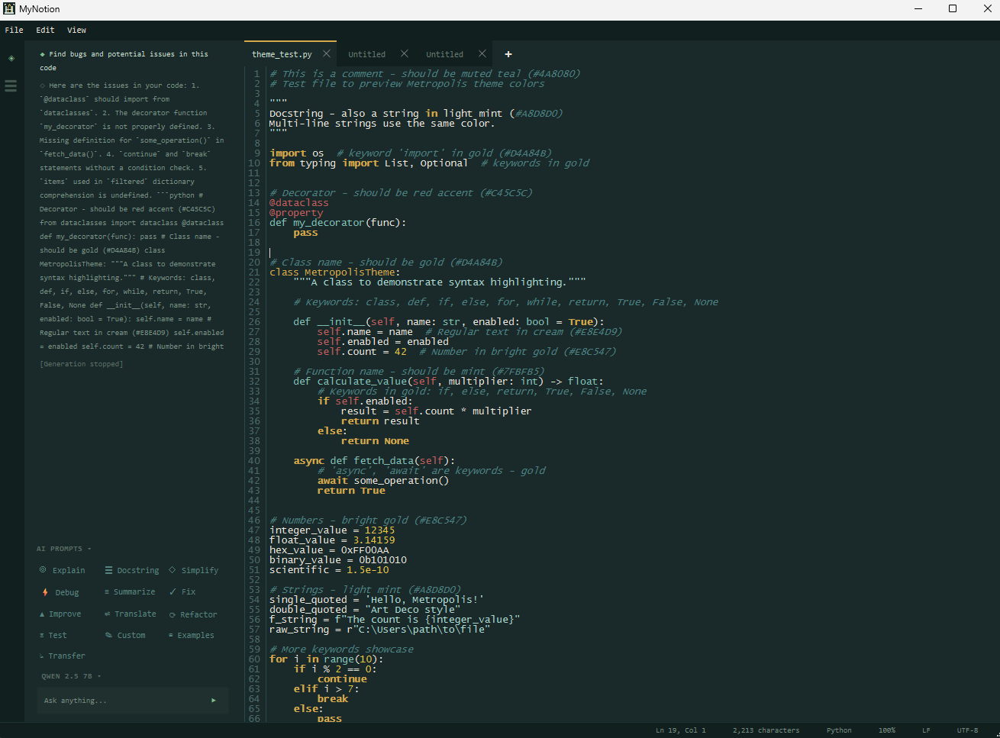

# MyNotion


MyNotion a lightweight text and code editor with AI integration. Think notepad but with syntax highlighting, multiple themes, and local AI assistance via Ollama.


 

## Features

- **Multi-tab editing** — Open and edit multiple files simultaneously
- **Syntax highlighting** — Python, JavaScript, JSON, HTML, CSS, Markdown
- **Color themes** — Dark (default), Monokai, Dracula, Light, Nord, Metropolis
- **Customizable fonts** — Choose font family and size (Consolas 12 by default)
- **Line numbers** — With current line highlighting
- **Recent files** — Quick access to recently opened files
- **Zoom** — Ctrl+Plus/Minus to adjust font size
- **AI Assistant** — Local AI integration via Ollama
  - 13 built-in prompts: Explain, Docstring, Simplify, Debug, Summarize, Fix, Improve, Translate, Refactor, Test, Custom, Examples, Transfer
  - Works on selected code or full file
  - "Replace" action to apply AI suggestions directly
  - Streaming responses with code block formatting

## Screenshots

*Coming soon*

## Installation

### Requirements

- Python 3.10+
- PyQt6

### Install from source

```bash
# Clone the repository
git clone https://github.com/gommezen/myNotion.git
cd myNotion

# Install dependencies
pip install -r requirements.txt

# Run the application
python src/main.py
```

### Build standalone executable (Windows)

```bash
pip install pyinstaller
pyinstaller --windowed --onefile --name MyNotion src/main.py
```

The executable will be in the `dist/` folder.

## Usage

### Keyboard Shortcuts

| Shortcut | Action |
|----------|--------|
| Ctrl+N | New file |
| Ctrl+O | Open file |
| Ctrl+S | Save |
| Ctrl+Shift+S | Save As |
| Ctrl+W | Close tab |
| Ctrl+Plus | Zoom in |
| Ctrl+Minus | Zoom out |
| Ctrl+, | Settings |

### Changing Theme

Go to **Edit > Settings** or press `Ctrl+,` to open the settings dialog. Select your preferred theme and font settings.

### Theme Colors (Metropolis)

The Metropolis theme uses these green shades (lightest to darkest):

| Element | Variable | Hex |
|---------|----------|-----|
| Selection highlight | `selection` | `#2D5A5A` |
| Inactive tabs | `chrome_hover` | `#1A3333` |
| Menu bar / toolbar | `chrome_bg` | `#122424` |
| Active tab / editor | `background` | `#0D1A1A` |

Theme colors can be customized in `src/core/settings.py`.

## Project Structure

```
src/
├── main.py              # Entry point
├── app.py               # QApplication setup
├── ui/                  # UI components
│   ├── main_window.py   # Main window with tabs, menus, toolbar
│   ├── editor_tab.py    # Individual editor tab widget
│   ├── custom_tab_bar.py # Styled tab bar with close buttons
│   └── settings_dialog.py # Settings UI
├── core/                # Core functionality
│   ├── settings.py      # App settings (QSettings wrapper)
│   └── recent_files.py  # Recent files tracking
├── ai/                  # Local AI integration (Ollama)
└── syntax/              # Syntax highlighting
    └── highlighter.py   # QSyntaxHighlighter implementations
```

## Development

### Setup development environment

```bash
pip install -r requirements.txt
pip install -r requirements-dev.txt
```

### Run tests

```bash
pytest tests/
```

### Quality checks

```bash
# Windows
scripts\quality_check.bat

# Git Bash / WSL / Linux / macOS
./scripts/quality_check.sh
```
